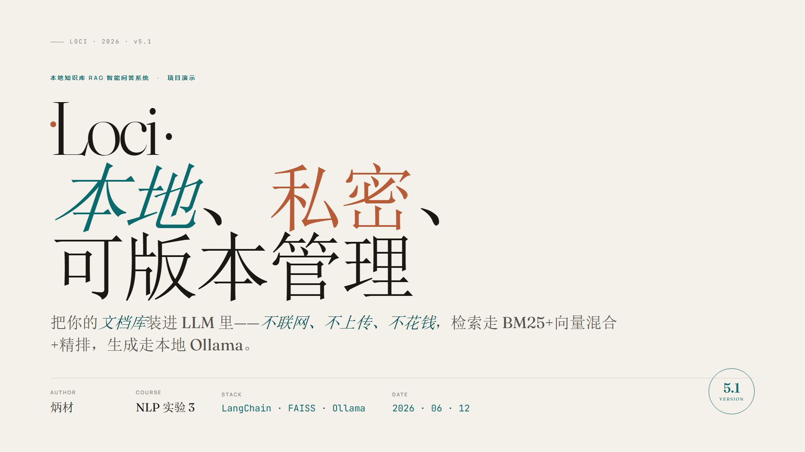
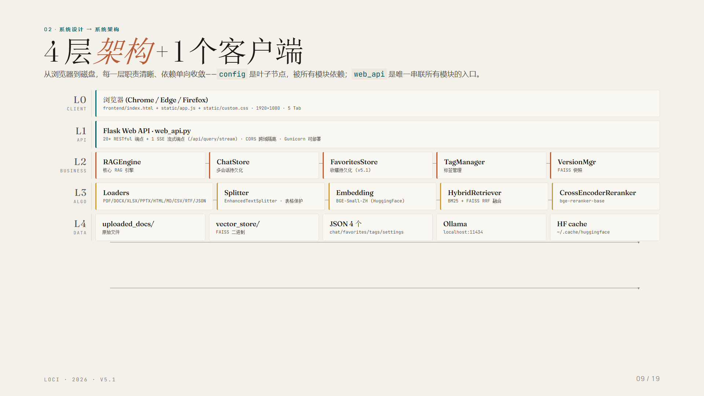
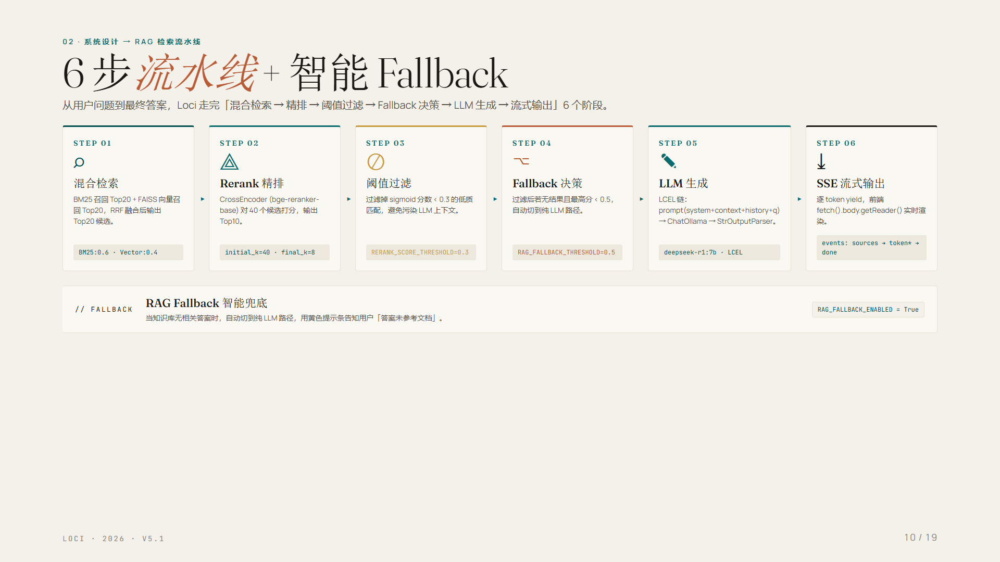

# 📚 Loci · 本地知识库 RAG 智能问答系统

> **本地 · 私密 · 可版本管理的中文 RAG 智能问答。**
> 15 种文档格式 · BM25 + 向量混合检索 · CrossEncoder 精排 · SSE 流式 · 自动 Fallback · 完整的 Web 产品闭环。

<div align="center">


</div>

---

## 🎬 一图看懂 Loci

<div align="center">



</div>

| | |
|:---:|:---:|
|  |  |
| **4 层隔离架构** (L0 浏览器 / L1 Web API / L2 业务 / L3 算法 / L4 数据) | **6 步 RAG 流水线** (混合检索 → 精排 → 阈值过滤 → Fallback → LLM → SSE) |

> 📑 完整 19 页项目演示文稿见 [docs/presentation/](docs/presentation/)（HTML + PDF）

---

## ✨ 为什么做 Loci？

把**你自己的文档库**装进 LLM，**不联网、不上传、不花钱**。  
Loci 是一个端到端的本地 RAG 系统，覆盖从文档摄入到答案生成的完整链路，可作为 **Agent / 大模型开发工程师** 面试时的项目经历。

| | |
|:---|:---|
| 🔒 **完全本地** | 0 网络请求，0 API Key 上传，Embedding/Rerank/LLM 全部本地推理 |
| 🧠 **完整 RAG 链路** | 文档解析 → 增强分片 → 混合检索 → 精排 → 生成 → 流式输出 |
| 📚 **15 种格式** | PDF / DOCX / PPTX / XLSX / CSV / HTML / MD / JSON / XML / RTF / TXT + URL 摄取 + 文件夹监控 |
| 🗂️ **产品化** | 5 Tab UI、会话/收藏/标签/版本管理、3 种导出（JSON/MD/PDF）、主题切换 |
| 🎨 **设计感** | Perplexity 学术图书馆风格、暖米色 + 墨绿 + Fraunces 衬线字体 |

---

## 🏗️ 核心架构

```
用户问题
   │
   ▼
[1] 混合检索 _hybrid_search()                    ◀── rank-bm25 + FAISS 向量召回
   │      BM25 召回 (jieba 分词)                 ◀── 关键词匹配
   │      FAISS 召回 (BGE-Small-ZH / nomic)      ◀── 语义召回
   │      RRF 融合 (BM25:0.6 + Vector:0.4)       ◀── 倒数排名融合
   ▼
[2] Rerank 精排 (BGE-Reranker-Base)              ◀── CrossEncoder 精排到 Top8
   ▼
[3] 阈值过滤 (score < 0.5 → Fallback)            ◀── 知识库无答案兜底
   ▼
[4] LLM 生成 (Ollama deepseek-r1:7b / OpenAI)    ◀── LangChain LCEL 链式调用
   ▼
[5] SSE 流式输出 (sources → token* → done)       ◀── 打字机效果
```

> 📐 完整架构、数据流、性能调优点见 [docs/ARCHITECTURE.md](docs/ARCHITECTURE.md)

---

## 🚀 5 行代码快速体验

```python
from loci.rag_engine import RAGEngine
from loci.config import CONFIG

# 1. 初始化引擎
engine = RAGEngine(CONFIG)

# 2. 摄入文档（支持 PDF / DOCX / PPTX / XLSX / URL ...）
engine.ingest_file("data/uploaded_docs/中山大学2025年招生简章.pdf")

# 3. 混合检索（BM25 + 向量 RRF + Rerank 精排）
sources = engine.retrieve("2025 年硕士招生有哪些新政策？", top_k=8)

# 4. 流式问答
for token in engine.stream_query("2025 年硕士招生有哪些新政策？"):
    print(token, end="", flush=True)
```

> 完整 API 见 [docs/API.md](docs/API.md)（20+ HTTP 端点 + SSE 协议 + curl/Python 示例）

---

## 🛠️ 技术栈

| 层 | 技术 |
|:---|:---|
| **前端** | 原生 HTML + CSS（CSS 变量主题）+ Vanilla JS（无构建工具、可直接 F5 调试） |
| **后端** | Flask 3 + Flask-CORS + SSE 流式 |
| **RAG 框架** | LangChain 1.x LCEL 链式调用 |
| **向量库** | FAISS（本地持久化，单机 950KB） |
| **关键词** | rank-bm25 + jieba 中文分词 |
| **精排** | sentence-transformers CrossEncoder (BGE-Reranker-Base) |
| **LLM 推理** | Ollama 本地 (deepseek-r1:7b) / OpenAI 兼容 (可选) |
| **Embedding** | BGE-Small-ZH (默认) / Ollama nomic-embed-text (可选) |
| **文档解析** | jin-doc-parser / PyPDF / python-docx / openpyxl / python-pptx / trafilatura / striprtf |
| **工程化** | threading.Lock + 原子写 + FAISS 版本快照 + watchdog 文件夹监控 |

---

## 📦 快速开始

### 环境要求

| 组件 | 最低 | 推荐 |
|:---|:---|:---|
| Python | 3.10 | 3.12 |
| 内存 | 8 GB | 16 GB+ |
| Ollama | 已运行 | + `deepseek-r1:7b` |
| Embedding | BGE-Small-ZH | 离线缓存 |
| Rerank | bge-reranker-base | 离线缓存 |

### 4 步上手

```bash
# 1. 克隆 & 安装依赖
git clone https://github.com/<your-username>/loci-rag.git
cd loci-rag
pip install -r requirements.txt

# 2. 启动 Ollama 并拉取模型（仅首次）
ollama pull deepseek-r1:7b
ollama pull nomic-embed-text  # 可选，Ollama Embedding 模式

# 3. 启动 Web 服务
python web_api.py
# → 浏览器打开 http://localhost:7862

# 4. 打开「知识库」Tab → 拖文件上传 → 切到「智能问答」Tab → 提问
```

> 💡 **完全离线运行**：首次启动会自动下载 BGE/Rerank 模型到 `~/.cache/huggingface`，之后可在 `HF_HUB_OFFLINE=1` 下零网络运行。

---

## 📂 项目结构

```
loci-rag/
├── web_api.py              # Flask Web 入口（主入口，~913 行）
├── config.py               # 统一配置（v5.1）
├── requirements.txt        # 依赖清单
├── README.md               # 项目说明
├── LICENSE                 # MIT 协议
├── .gitignore              # Git 忽略规则
│
├── loci/                   # 核心业务模块包
│   ├── __init__.py
│   ├── rag_engine.py       # RAG 核心引擎（1333 行：混合检索 + Rerank + Fallback + 流式）
│   ├── chat_store.py       # 会话 JSON 持久化（线程安全 + 原子写）
│   ├── favorites_store.py  # 收藏 JSON 持久化
│   ├── tag_manager.py      # 标签管理
│   ├── version_manager.py  # FAISS 向量库版本快照/回滚
│   ├── web_loader.py       # URL/网页摄取（trafilatura）
│   ├── folder_watcher.py   # 文件夹监控（watchdog）
│   ├── exporters.py        # 导出模块（JSON/Markdown/PDF）
│   └── settings_manager.py # 设置持久化
│
├── frontend/               # 前端资源
│   ├── index.html          # 前端入口（2056 行：HTML + inline CSS）
│   └── static/
│       ├── app.js          # 前端逻辑（1795 行：SSE 流式 + 5 Tab 状态机）
│       └── custom.css      # 设计令牌
│
├── data/                   # 运行时数据（.gitignore，用户私有）
│   ├── chat_history.json
│   ├── favorites.json
│   ├── tags.json
│   ├── user_settings.json
│   ├── uploaded_docs/      # 上传的文档
│   ├── vector_store/       # FAISS 索引文件
│   └── vector_store_versions/  # 版本快照
│
├── assets/                 # README 演示截图
│
├── tests/                  # 单元测试
│
├── .github/workflows/      # CI（ruff + pytest）
│
└── docs/                   # 项目文档
    ├── USER_GUIDE.md       # 用户手册
    ├── API.md              # HTTP API 参考
    ├── ARCHITECTURE.md     # 系统架构
    ├── DEVELOPMENT.md      # 开发指南
    ├── CHANGELOG.md        # 更新日志
    └── presentation/       # 19 页项目演示文稿
```

---

## 🎯 技术亮点（面试时这样讲）

| 亮点 | 关键数字 | 体现的能力 |
|:---|:---|:---|
| **混合检索** | BM25 (0.6) + 向量 (0.4) RRF 融合 | 关键词 + 语义互补，适配带编号/具体数据的问题 |
| **Rerank 精排** | Top40 粗排 → Top8 精排 | CrossEncoder 二次精排，提升 Precision@K |
| **双模式 Embedding** | BGE-Small-ZH / Ollama nomic | 本地优先 + 灵活切换 |
| **增强分片** | 表格保护 + 标题绑定 + 30% overlap + 去重 | 解决"表格被打散、章节被截断"问题 |
| **Fallback 机制** | Rerank 最高分 < 0.5 切纯 LLM | 兜底体验，避免"答非所问" |
| **流式 + 打字机** | SSE + 18ms/字符打字机 | 完整的前后端流式体验 |
| **FAISS 版本快照** | 两段式回滚（先备份 → 替换 → 失败还原） | 数据可恢复、生产可回滚 |
| **线程安全 + 原子写** | `threading.Lock` + 临时文件 + `os.replace` | JSON 持久化不会半写损坏 |
| **15 种格式** | PDF/DOCX/PPTX/XLSX/CSV/HTML/MD/JSON/XML/RTF/TXT/URL... | 工程完整度 |
| **设计感** | Perplexity 学术图书馆风 | 产品化意识 |

> 完整演进史见 [docs/CHANGELOG.md](docs/CHANGELOG.md)（v1.0 → v5.1）

---

## 🧪 运行测试

```bash
# 单元测试（核心 RAG 链路 + 持久化 + 路由）
pytest tests/ -v

# Lint
ruff check loci/ web_api.py
ruff format --check loci/ web_api.py
```

CI 由 `.github/workflows/lint.yml` 自动跑（ruff + pytest）。

---

## 📚 文档导航

| 文档 | 适合谁 | 包含内容 |
|:---|:---|:---|
| [README.md](README.md) | 所有人 | 30 秒快速了解 + 5 分钟上手 |
| [docs/USER_GUIDE.md](docs/USER_GUIDE.md) | 最终用户 | 5 Tab 详细使用流程 + 快捷键 + FAQ |
| [docs/API.md](docs/API.md) | 前端 / 集成方 | 20+ HTTP 端点 + SSE 协议 + JSON Schema |
| [docs/ARCHITECTURE.md](docs/ARCHITECTURE.md) | 架构师 / 高级开发 | 模块边界 + 数据流 + 性能调优点 |
| [docs/DEVELOPMENT.md](docs/DEVELOPMENT.md) | 贡献者 | 开发环境 + 代码规范 + 提 PR 流程 |
| [docs/CHANGELOG.md](docs/CHANGELOG.md) | 所有人 | v1.0 → v5.1 演进 + 迁移指南 |
| [docs/presentation/](docs/presentation/) | 招聘 / 分享 | 19 页项目演示文稿（HTML + PDF） |

---

## 🗺️ 路线图

- [x] v1.0–v4.2: 基础 RAG + UI + 多格式解析
- [x] v5.0: 项目结构重构（`loci/` 包 + `frontend/` + `data/`）
- [x] v5.1: 移除 Gradio 入口，前端收敛到原生 HTML/CSS/JS
- [ ] v5.2: LangGraph Agent 工具调用（KB → Web → 纯 LLM 三步兜底）
- [ ] v5.3: RAG 评估（ragas）：Recall@K / Context Precision / Answer Relevancy
- [ ] v5.4: OpenAI / 通义 / 智谱 云端 LLM 适配
- [ ] v5.5: Docker Compose 一键部署（含 Ollama 服务）
- [ ] v6.0: 多模态（图片问答 + 表格结构化抽取）

---

## 🤝 贡献

欢迎 PR！请阅读 [docs/DEVELOPMENT.md](docs/DEVELOPMENT.md) 了解开发规范。

```bash
# 开发流程
git checkout -b feat/your-feature
# ... 写代码 ...
git commit -m "feat: your feature description"  # Conventional Commits
git push origin feat/your-feature
# 提 PR
```

---

## 📄 许可

[MIT License](LICENSE) — 自由使用、修改、分发。

---

## 🙏 致谢

- [LangChain](https://github.com/langchain-ai/langchain) · RAG 框架
- [FAISS](https://github.com/facebookresearch/faiss) · 向量检索
- [Ollama](https://ollama.ai) · 本地 LLM 推理
- [Flask](https://flask.palletsprojects.com) · Web 框架
- [BAAI/bge-small-zh-v1.5](https://huggingface.co/BAAI/bge-small-zh-v1.5) · 中文 Embedding
- [BAAI/bge-reranker-base](https://huggingface.co/BAAI/bge-reranker-base) · CrossEncoder 精排
- [rank-bm25](https://github.com/dorianbrown/rank_bm25) · BM25 算法
- [jieba](https://github.com/fxsjy/jieba) · 中文分词
- [trafilatura](https://github.com/adbar/trafilatura) · 网页正文抽取
- [watchdog](https://github.com/gorakhargosh/watchdog) · 文件夹监控

---

<div align="center">

**如果这个项目对你有帮助，欢迎 ⭐ Star 支持一下！**

Made with ❤️ for Agent / LLM Engineers

</div>
